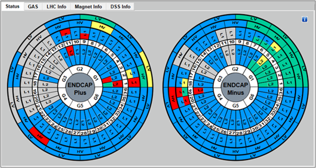
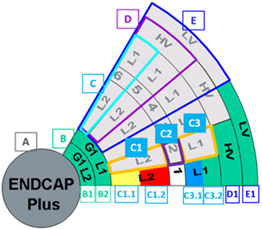
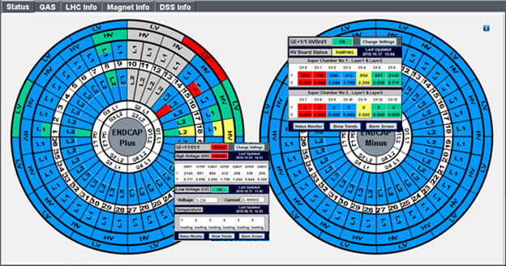
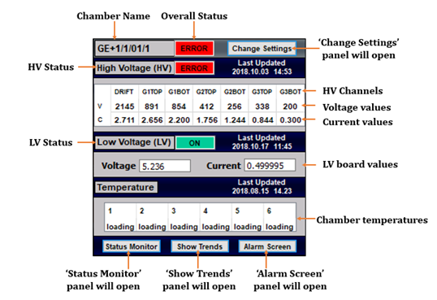
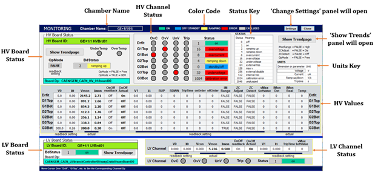
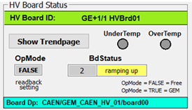

<html>
The ‘Status’ tab in the main interface of DCS provides an overview for the whole system i.e. HV and LV status, radiation monitoring etc. Color at a given time indicates the status of the selected section.
<align=middle>
##Color Code

##Detector Status
The circular disc regions indicate End Caps of the CMS detector and each disc is created with trapezoids. Trapezoids represent Chambers (complete GE1/1 detectors) and provide information on power supply boards and gas channels. 

###Representation
<align=middle>

A : End Cap Name (‘Plus / Minus’)

B : Gas Status 
&nbsp;&nbsp;&nbsp;&nbsp;&nbsp;B1	: Gas Status Bottom Layer Chambers (L1) 
&nbsp;&nbsp;&nbsp;&nbsp;&nbsp;B2 	: Gas Status of Top Layer Chambers (L2) 

C : Super Chamber 
&nbsp;&nbsp;&nbsp;&nbsp;&nbsp;C1 : Top Layer Chamber (L1) 
&nbsp;&nbsp;&nbsp;&nbsp;&nbsp;&nbsp;&nbsp;&nbsp;&nbsp;&nbsp;C1.1 	: High Voltage Status of Bottom Layer Chamber (L2) 
&nbsp;&nbsp;&nbsp;&nbsp;&nbsp;&nbsp;&nbsp;&nbsp;&nbsp;&nbsp;C1.2 	: Low Voltage Status of Bottom Layer Chamber (L2) 
&nbsp;&nbsp;&nbsp;&nbsp;&nbsp;C2 : Super Chamber Number 
&nbsp;&nbsp;&nbsp;&nbsp;&nbsp;C3 : Bottom Layer Chamber (L2) 
&nbsp;&nbsp;&nbsp;&nbsp;&nbsp;&nbsp;&nbsp;&nbsp;&nbsp;&nbsp;C3.1 	: High Voltage Status of Top Layer Chamber (L1) 
&nbsp;&nbsp;&nbsp;&nbsp;&nbsp;&nbsp;&nbsp;&nbsp;&nbsp;&nbsp;C3.2 	: Low Voltage Status of Top Layer Chamber (L1) 

                              

D : HV Board 
&nbsp;&nbsp;&nbsp;&nbsp;&nbsp;D1 : High Voltage Board Status 

E : LV Board 
&nbsp;&nbsp;&nbsp;&nbsp;&nbsp;E1 : Low Voltage Board Status 

Refer ‘GEM Structural Delineation’ for more information on power supply module board divisions and power supply connections.

##Pop Up Panels
Each of the above parts will present popup panels with further relevant information if the user clicked on a section.
<align=middle>

Chamber Status Popup Panel

This popup panel displays the overall status of a single Chamber in a Super Chamber. Refer the image for the display of the Chamber Status popup panel. 
<align=middle>

Tip 
Chamber status, HV status, LV status, voltage values and current values  of GEM foils will be presented with the relevant color based on defined ranges for the status.

The buttons in the popup panel are designed for tasks given below.

##1) Status Monitor Panel 
This panel is used only for monitoring the status of HV and LV, thus users cannot perform any changes to HV and LV values on this panel. 
<align=middle>

This panel displays more information on the HV and LV status of a single Chamber and users can monitor the information easily in addition to moving to more panels.

HV Board Status 
Accessible information 
■	HV Board ID  
■	Temperature status 
■	HV Board status  
■	Operating Mode  
■	HV Board DP  
 
Accessible panels 
■	Click on ‘Show Trends’ to access HV trends panel 

</html>